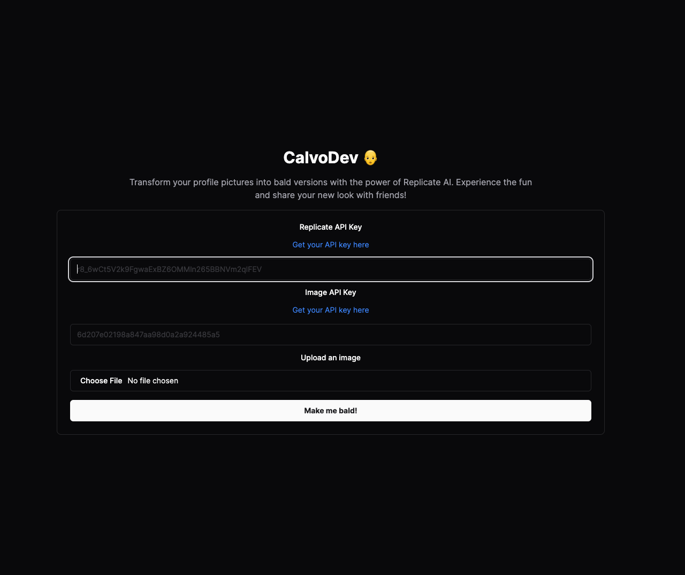

<p align="center">
  
</p>

# CalvoDev 🧑‍🦲

<p>Transform your profile pictures into bald versions with the power of Replicate AI. Experience the fun and share your new look with friends!</p>

## 🚀 How to use

- Clone this repository
```
git clone https://github.com/birobirobiro/calvo-dev.git
cd calvodev
```

- Install dependencies
```
pnpm install
```

- Rename `.env` to `.env.local`
```
mv .env .env.local
```

- Edit `.env.local` with your credentials and get API keys

  - [Get Replicate API Key](https://replicate.com/account/api-tokens)
  - [Get Image API Key](https://freeimage.host/page/api)

- Run project
```
pnpm dev
```

## 🚀 Techs

- [Next.js](https://nextjs.org/)
- [Tailwind CSS](https://tailwindcss.com/)
- [shadcn/ui](https://ui.shadcn.com/)
- [Replicate AI](https://replicate.com/)
- [Free Image Host](https://freeimage.host/)

---

Feito com ♥ by [birobirobiro](https://birobirobiro.dev)
